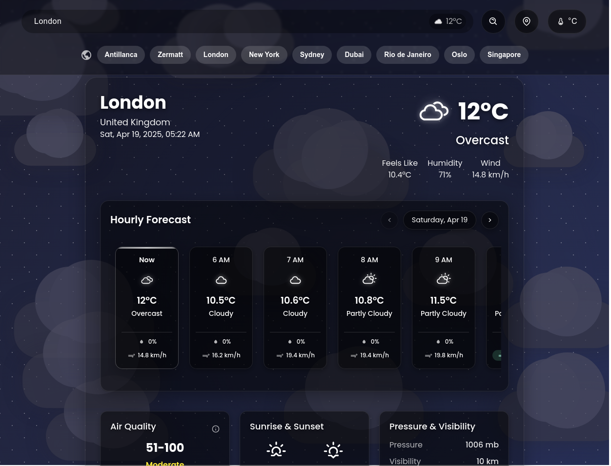

# Weather Dashboard

A beautiful, modern weather dashboard built with React, featuring real-time weather data, location search, hourly and daily forecasts, and animated weather icons.



## Features

- 🌤️ Real-time weather data from WeatherAPI.com
- 🔍 Location search with autocomplete
- 📍 Current location detection
- 📱 Responsive design that works on all devices
- 🌡️ Temperature unit toggle (Celsius/Fahrenheit)
- 📊 10-day weather forecast
- ⏱️ Hourly forecast with beautiful UI
- 🎭 Animated weather icons based on conditions
- 💨 Wind, humidity, and "feels like" temperature data
- 🌅 Sunrise and sunset times
- 🌈 Air quality index (AQI)
- ☀️ UV index with color indicators
- ✨ Sleek glass-morphism design with modern UI

## Getting Started

### Prerequisites

- Node.js (version 14.x or higher)
- npm or yarn

### Installation

1. Clone the repository:
   ```bash
   git clone https://github.com/mighty-phoenix/weather-dashboard.git
   cd weather-dashboard
   ```

2. Install dependencies:
   ```bash
   npm install --force
   ```

3. Get an API key from [WeatherAPI.com](https://www.weatherapi.com/)

4. Create a `.env` file in the root directory and add your API key from [WeatherApi](https://weatherapi.com):
   ```
   REACT_APP_WEATHER_API_KEY=your_api_key_here
   ```
5. Start the development server:
   ```bash
   npm start
   ```

## Usage

- **Search for a location**: Enter a city name, ZIP code, or coordinates in the search box
- **Use current location**: Click the location icon to use your current location
- **Switch temperature units**: Click the temperature unit toggle (°C/°F)
- **View hourly forecast**: Scroll horizontally through the hourly forecast section
- **View daily forecast**: Check the 10-day forecast at the bottom
- **Check weather details**: View additional details like humidity, wind speed, feels like temperature

## Customization

You can customize the dashboard by modifying the styled components in each file. The main styling is done using styled-components.

### Change the background gradient

In `src/App.js`, find the `AppContainer` styled component and modify the background property:

```javascript
const AppContainer = styled.div`
  background: linear-gradient(135deg, #6e8efb, #a777e3); // Change these colors
  // ...
`;
```

### Change the dashboard theme

You can modify the dashboard's theme by changing the background opacity and colors in the `WeatherDashboard` styled component:

```javascript
const WeatherDashboard = styled.div`
  background: rgba(255, 255, 255, 0.2); // Change opacity or color
  // ...
`;
```

## Architecture

The project uses the following architecture:

- `src/App.js`: Main component that renders the dashboard
- `src/components/`: Reusable UI components
- `src/hooks/`: Custom React hooks, including the `useWeather` hook for API calls
- `src/styles/`: Global styles and theme

## Technologies Used

- React.js
- styled-components for styling
- framer-motion for animations
- axios for API requests
- react-icons for weather icons

## Contributing

Contributions are welcome! Please feel free to submit a Pull Request.

## License

This project is licensed under the MIT License - see the LICENSE file for details.

## Acknowledgements

- [WeatherAPI.com](https://www.weatherapi.com/) for providing the weather data
- [React Icons](https://react-icons.github.io/react-icons/) for the weather icons
- [Framer Motion](https://www.framer.com/motion/) for the animations
